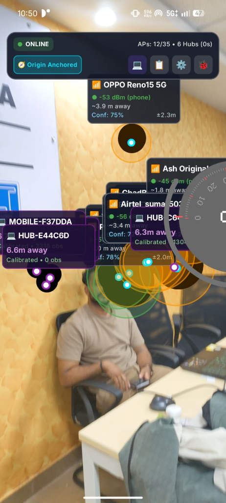
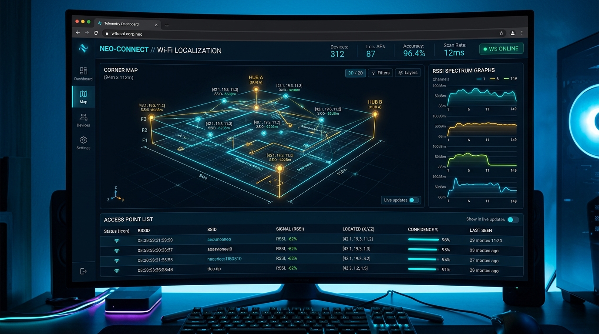
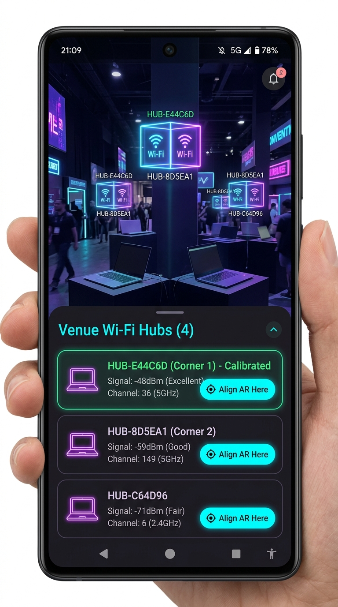
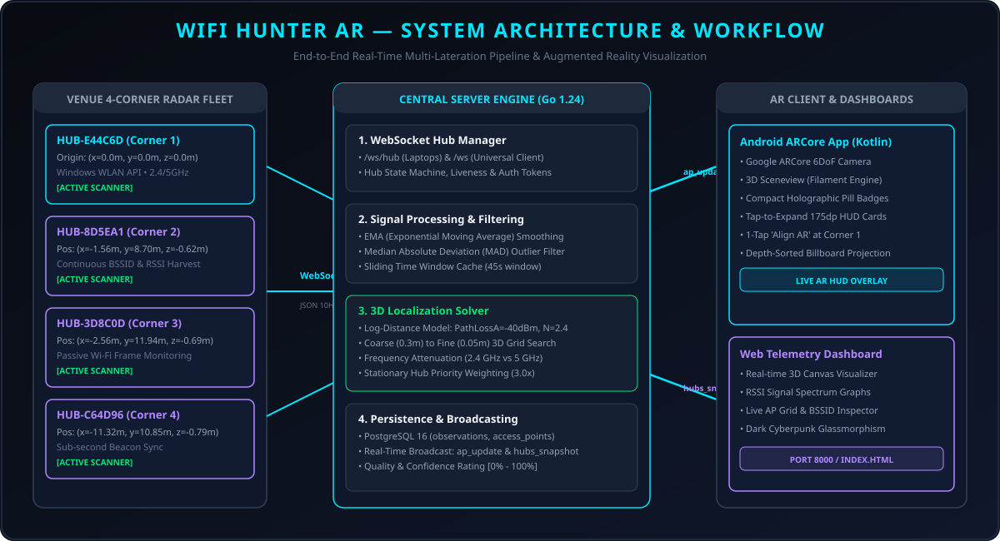
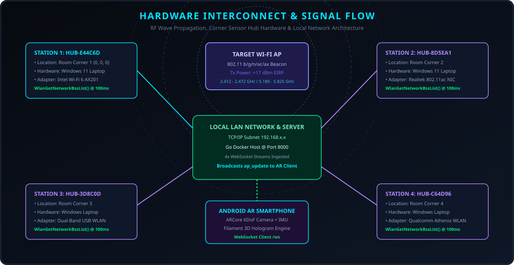
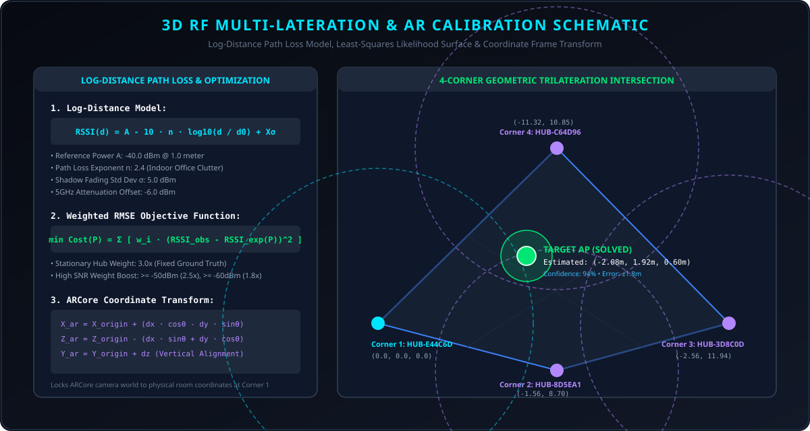
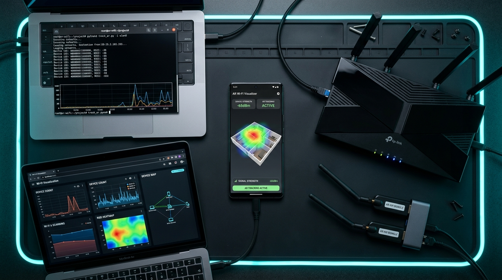
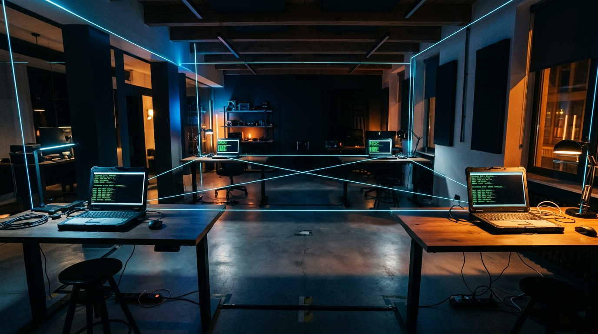
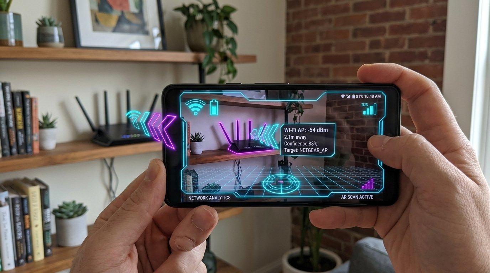

# WIFI HUNTER AR 🎯


## Basic Details
### Team Name: NAHxFAH


### Team Members
- Team Lead: Sreedev S S - College of Engineering Attingal
- Member 2: Aashray J Pramod - College of Engineering Attingal

### Project Description
WIFI HUNTER AR is a distributed indoor spatial intelligence and Augmented Reality platform that turns ordinary venue laptops into a synchronized radar network. It passively captures 2.4 GHz and 5 GHz radio frequencies, computes 3D log-distance trilateration in real-time via a Go backend, and renders live holographic Wi-Fi access points floating in physical space on an Android ARCore app.

### The Problem (that doesn't exist)
Have you ever stared blankly at your smartphone's Wi-Fi list while sitting in a room, desperately wishing you possessed superhuman laser-vision to literally see the invisible electromagnetic radio waves bouncing off the walls and hunt down the exact physical location of the hotspot/router like a cybernetic Ghostbuster?

### The Solution (that nobody asked for)
WIFI HUNTER AR solves this non-existent crisis by deploying laptops to act as hubs multiple corners of your room to form a high-precision RF sonar grid with local grid system as GPS are useless indoors. The laptops continuously scan BSSIDs and RSSI signals via native Windows WLAN APIs, stream them to a high-concurrency Go server that computes 3D spatial trilateration, and project floating Augmented Reality holograms directly onto your Android phone's camera feed so you can literally walk up to the invisible Wi-Fi signal and look it in the eye!

## Technical Details
### Technologies/Components Used
For Software:
- Languages: Go (1.24), Kotlin (1.9+), Python (3.11+), PostgreSQL
- Frameworks: Android Jetpack Compose, Google ARCore, Sceneview (Google Filament 3D Engine), Gorilla WebSocket, Chi Router
- Libraries: Windows Native Wifi API (WlanAPI via ctypes), pgx/v5 (PostgreSQL Driver), kotlinx.coroutines, kotlinx.serialization
- Tools: Docker & Docker Compose, Android Studio, Gradle, PostgreSQL 16, Git

For Hardware:
- 4+ Windows Laptops (acting as stationary corner venue scanning radar hubs)
- 1x Android Smartphone running Android 10+ with Google Play Services for AR (ARCore) support
- Local Wi-Fi Router / Hotspot from mobile phones

### Implementation
For Software:
# Installation
```bash
# 1. Clone repository
git clone https://github.com/MTCodes01/NAHxFAH.git
cd NAHxFAH

# 2. Start PostgreSQL & Go Backend Server via Docker
docker compose up -d --build

# 3. Setup Python Hub Agent on Venue Laptops
cd hub
python -m venv venv
.\venv\Scripts\activate
pip install -r requirements.txt

# 4. Build Android AR App (in wifiapp/)
cd ../wifiapp
$env:JAVA_HOME = "E:\Android Studio\jbr" # or your local JDK path
.\gradlew.bat assembleDebug
```

# Run
```bash
# 1. Run Backend Server (Docker Compose)
docker compose up -d

# 2. Run Hub Agent on each Corner Laptop (connects to server LAN IP)
cd hub
python main.py

# 3. Launch Android AR App on your phone
# Install wifiapp/app/build/outputs/apk/debug/app-debug.apk
# Open WIFI HUNTER AR, connect to ws://<SERVER_IP>:8000/ws, and align AR at Corner 1!
```

### Project Documentation
For Software:

# Screenshots (Add at least 3)

*Augmented Reality HUD displaying floating 3D holographic Wi-Fi access points, real-time RSSI, estimated distance, and venue corner hub markers*


*Desktop spatial telemetry web dashboard displaying 3D localized wireframe grid, RSSI spectrum graphs, and live access point tracking*


*Venue Hubs Management sheet on Android mobile showing 4 active corner radar laptops and 1-tap physical AR world alignment*

# Diagrams

*End-to-end system architecture: Windows Hub agents capturing RSSI -> Central Go Server trilateration engine -> PostgreSQL storage -> Android ARCore real-time 3D overlay*

For Hardware:

# Schematic & Circuit

*Hardware interconnect and signal flow: Omnidirectional RF beaconing, 4-corner laptop Wi-Fi NICs, local LAN WebSocket multiplexing, and Android AR phone receiver*


*3D RF multi-lateration geometric schematic: Log-distance path loss propagation model, least-squares likelihood surface, and ARCore world transformation*

# Build Photos

*Physical hardware deployment components: Android AR smartphone, dual scanning laptops running hub agents, 802.11 Wi-Fi router, and dual-band USB Wi-Fi adapters*


*Physical room deployment: 4 laptop hub radar stations positioned in the 4 corners of the room synchronized over local LAN*


*Live AR demonstration: First-person augmented reality camera view with floating holographic direction markers pointing directly to the hidden Wi-Fi router*

### Project Demo
# Video
[Add your demo video link here]
*Live demonstration of 4-corner laptop radar synchronization, venue calibration, and finding hidden Wi-Fi access points in AR*

# Additional Demos
[Add any extra demo materials/links]

## Team Contributions
- Sreedev S S: Go backend architecture, 3D grid localization engine, WebSocket hub manager, and venue multi-hub calibration testing
- Aashray J Pramod: Windows WLAN native hub agent, signal processing (EMA/MAD), telemetry web dashboard, and Android ARCore mobile client

---
Made with ❤️ at TinkerHub Useless Projects @CEAL


