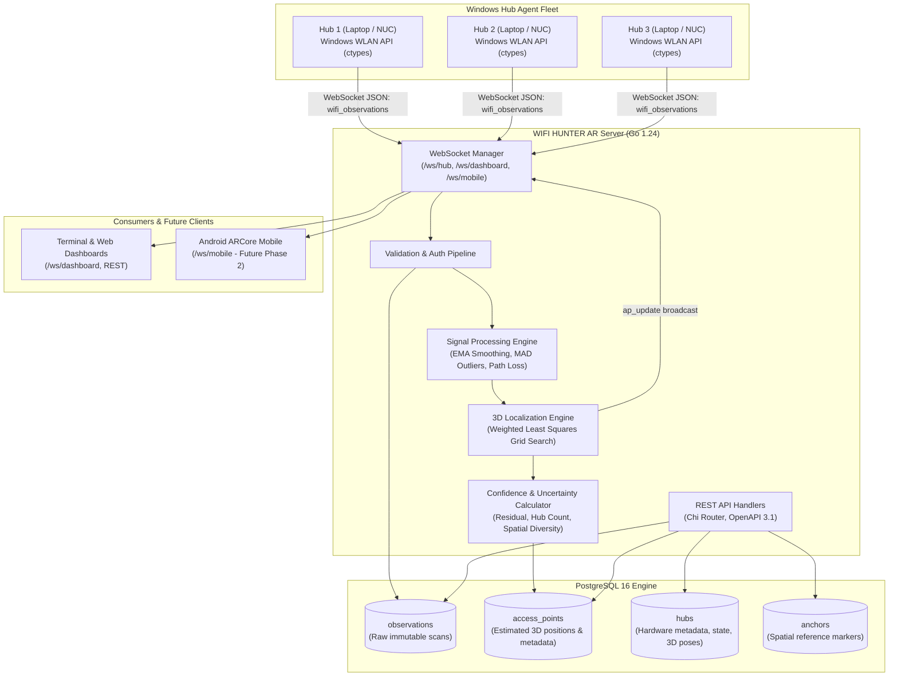

# WIFI HUNTER AR — Architecture Specification

## 1. System Overview

**WIFI HUNTER AR** is an indoor spatial intelligence platform that passively detects, aggregates, and localizes 802.11 Wi-Fi Access Points (APs) in a shared 3D local coordinate space.

The system is designed from the ground up for a two-tier Phase 1 architecture (Windows Scanning Hubs + Centralized Go Backend) with full forward-compatibility for Phase 2 mobile Augmented Reality (Android ARCore).

---

## 2. Core Architectural Principles

1. **Zero Mock / Zero Synthetic Production Paths**:
   - Production code executes real Windows Native Wi-Fi API (`wlanapi.dll`) calls.
   - If a Wi-Fi adapter is absent or disabled, the hub reports `status: "unavailable"` with diagnostic root causes, rather than generating synthetic RSSI values.
2. **Raw Immutability**:
   - Every raw observation ingested from a hub is stored verbatim in the `observations` table (`rssi_dbm`, `frequency_mhz`, `channel`, `link_quality`, `timestamp`, `hub_position`).
   - Signal smoothing, path loss modeling, and localization are applied in-memory and reflected in `access_points`. Raw observations are never altered.
3. **LAN and Docker Coexistence**:
   - The Go backend is containerized via multi-stage Docker builds and binds to `0.0.0.0:8000`.
   - PostgreSQL is strictly internal to the Docker network (`5432` is unmapped to the host), exposing only port `8000`.
   - External Windows Hub laptops reach the server over LAN via `ws://<SERVER_LAN_IP>:8000/ws/hub`.
4. **ARCore Readiness**:
   - All spatial calculations operate on a right-handed Local Cartesian 3D coordinate system (meters: $+X$ East/Right, $+Y$ North/Forward, $+Z$ Up).
   - The `anchors` subsystem allows mapping physical visual fiducials or ARCore cloud anchors directly to local coordinates without altering the localization pipeline.

---

## 3. Component Details

### 3.1 Server Subsystems (`/server`)

- **Router & HTTP Engine**:
  - Built with `go-chi/chi/v5` for lightweight, idiomatic routing.
  - Middleware stack includes request logging, panic recovery, CORS, and request timeouts.
  - Consistent JSON response envelopes:
    - Success: `{"data": ...}`
    - Error: `{"error": {"code": "...", "message": "..."}}`

- **WebSocket Hub & Dispatcher (`server/internal/websocket/`)**:
  - Independent client registries: `HubClient`, `DashboardClient`, and `MobileClient`.
  - Non-blocking client broadcasts using dedicated per-connection outbound channels (`chan []byte`, buffer size 256). Slow or dead clients are culled after write timeouts.
  - Heartbeat & ping/pong liveness monitoring (30s timeout).

- **Signal Processing (`server/internal/services/signal_processing.go`)**:
  - **Exponential Moving Average (EMA)**:
    $$\bar{R}_t = \alpha \cdot R_t + (1 - \alpha) \cdot \bar{R}_{t-1}$$
    Maintains per-`(hub_id, bssid)` smoothed RSSI in-memory to dampen high-frequency multipath fluctuations.
  - **Median Absolute Deviation (MAD)**:
    Rejects transient burst anomalies where $|R - \text{median}| > 2.5 \cdot \text{MAD}$.
  - **Log-Distance Path Loss Model**:
    $$d = 10^{\frac{A - \text{RSSI}}{10 \cdot n}}$$
    Where $A$ is the reference RSSI at 1 meter (-40 dBm default), and $n$ is the path loss exponent (2.7 default for indoor office).

- **Localization Engine (`server/internal/services/localization.go`)**:
  - Multi-lateration requires $\ge 3$ distinct hubs observing the same BSSID within a configurable time window (default 45s).
  - Spatial diversity verification: Hubs must not be collinear or co-located (minimum bounding perimeter / convex area threshold).
  - Fine-grained 3D Grid Search:
    Searches candidate coordinates around the centroid of observing hubs, minimizing the weighted residual:
    $$\text{Cost}(x, y, z) = \sum_{i=1}^{H} w_i \cdot \left| \sqrt{(x - x_i)^2 + (y - y_i)^2 + (z - z_i)^2} - d_i \right|^2$$
  - Position smoothing over successive localization windows via EMA ($x, y, z$) prevents jumpy estimates.

- **Hub Management (`server/internal/services/hub_manager.go`)**:
  - Tracks registration, hardware specs, positions, and heartbeat liveness.
  - States:
    - `ONLINE`: Heard from within $< 15$ seconds.
    - `STALE`: Heard from within $15 - 30$ seconds.
    - `OFFLINE`: No response for $> 30$ seconds.

### 3.2 Hub Agent Subsystems (`/hub`)

- **Windows Native Wi-Fi Scanner (`hub/windows/wlan_api.py`)**:
  - Pure Python + standard library `ctypes`.
  - Interfaces directly with `wlanapi.dll` using `WlanOpenHandle`, `WlanEnumInterfaces`, `WlanScan`, `WlanGetNetworkBssList`, and `WlanFreeMemory`.
  - Correct C-struct alignment matching Windows SDK 10/11:
    - `DOT11_MAC_ADDRESS` (6 octets)
    - `WLAN_BSS_ENTRY` (360+ bytes struct with variable IE offsets)
    - `lRssi` extracted directly in dBm (-100 to 0)
    - Frequency extracted in kHz, converted to MHz
    - Channel computed from 2.4 GHz and 5 GHz band lookup tables
- **Persistent Identity (`hub/identity.py`)**:
  - Stored in `hub_data/identity.json`.
  - Format: `HUB-XXXXXX` (cryptographic hex). Created once on initial startup and retained across restarts and moves.
- **Async WebSocket Client (`hub/websocket_client.py`)**:
  - Built on `websockets` and `asyncio`.
  - Manages automatic reconnection with exponential backoff: $1\text{s} \to 2\text{s} \to 4\text{s} \to 8\text{s} \to 16\text{s} \to 30\text{s}$ (cap).
  - Automatic re-registration with current hardware position upon reconnection.
- **Terminal UI (`hub/terminal_ui.py`)**:
  - Live, flicker-free terminal dashboard rendered with `rich`.
  - Displays Hub ID, Connection State, Configured Position, Interface Name, AP Count, Top Signal Strengths, and Ingestion Metrics.

---

## 4. Database Schema and Storage Strategy

- **Migrations Engine**: `golang-migrate` integrated natively into the server startup sequence.
- **Tables**:
  1. `hubs`: Registered hubs, position, status, last seen.
  2. `access_points`: Aggregated APs, estimated $X, Y, Z$, confidence, error radius, status (`unknown`, `insufficient_hubs`, `localized`, `degraded`).
  3. `observations`: Timeseries of raw scan entries. Indexed by `(bssid, timestamp DESC)` and `(hub_id, timestamp DESC)`.
  4. `anchors`: Physical and AR anchors.
- **Observation Retention Worker**:
  A background goroutine runs hourly, purging raw observations older than `OBSERVATION_RETENTION_HOURS` (default: 24h). Aggregated `access_points` records remain intact.

---

## 5. Security & Network Topology

- **Authentication**: Hubs supply a shared pre-shared secret `api_key` in the `hub_register` payload. The server validates this using constant-time byte comparison (`crypto/subtle.ConstantTimeCompare`) to prevent timing side-channels.
- **Network Boundaries**:
  - Port `8000`: Exposed to LAN for HTTP and WebSocket traffic.
  - Port `5432` (Postgres): Kept on Docker bridge network `backend_net`; not exposed to LAN.
