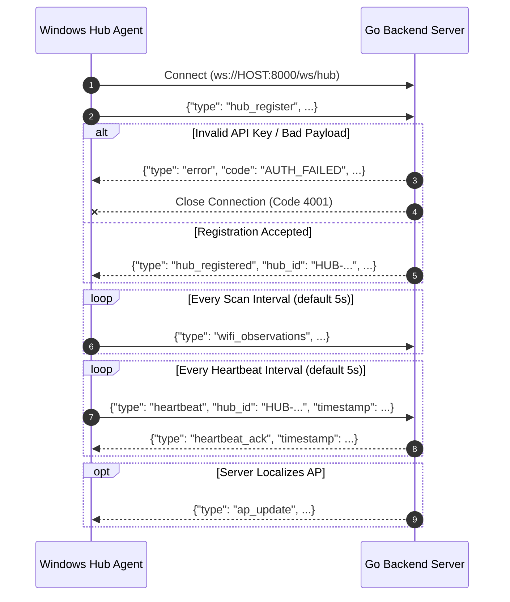

# WIFI HUNTER AR — WebSocket Protocol Specification

## 1. Protocol Architecture

The **WIFI HUNTER AR** protocol is a JSON-based bidirectional messaging protocol over WebSockets. All messages share a common discriminator field `"type"`.

### WebSocket Endpoints

| Endpoint | Direction | Auth Required | Purpose |
|---|---|---|---|
| `/ws/hub` | Bidirectional | Yes (`api_key` in `hub_register`) | Windows Hub scanning agents |
| `/ws/dashboard` | Server → Client | No | Realtime monitoring, telemetry, terminal dashboards |
| `/ws/mobile` | Bidirectional | No / Token | Future Android ARCore client integration |

---

## 2. Hub Connection Flow (`/ws/hub`)



---

## 3. Message Schemas

### 3.1 Hub → Server Messages

#### `hub_register`
Sent immediately upon establishing the WebSocket connection. Must be the first message sent.
```json
{
  "type": "hub_register",
  "hub_id": "HUB-A7F32C",
  "api_key": "your_secure_shared_api_key",
  "device_type": "laptop",
  "platform": "windows-11",
  "version": "1.0.0",
  "coordinate_system": "local",
  "position": {
    "x": 4.20,
    "y": 8.10,
    "z": 1.00
  },
  "timestamp": "2026-09-12T01:30:00.000Z"
}
```

#### `wifi_observations`
Dispatched after each scan cycle completes. Contains batch observations from the native Wi-Fi adapter.
```json
{
  "type": "wifi_observations",
  "hub_id": "HUB-A7F32C",
  "position": {
    "x": 4.20,
    "y": 8.10,
    "z": 1.00,
    "coordinate_system": "local"
  },
  "scan_duration_ms": 3200,
  "observations": [
    {
      "bssid": "AA:BB:CC:DD:EE:01",
      "ssid": "Campus-Secure",
      "rssi_dbm": -48,
      "link_quality": 84,
      "frequency_mhz": 5180,
      "channel": 36
    },
    {
      "bssid": "AA:BB:CC:DD:EE:02",
      "ssid": "Campus-Guest",
      "rssi_dbm": -52,
      "link_quality": 78,
      "frequency_mhz": 2437,
      "channel": 6
    },
    {
      "bssid": "12:34:56:78:9A:BC",
      "ssid": "<hidden>",
      "rssi_dbm": -71,
      "link_quality": 45,
      "frequency_mhz": 5200,
      "channel": 40
    }
  ],
  "timestamp": "2026-09-12T01:30:05.120Z"
}
```

#### `heartbeat`
Keepalive ping sent when no observation message has been dispatched within `heartbeat_interval_seconds`.
```json
{
  "type": "heartbeat",
  "hub_id": "HUB-A7F32C",
  "timestamp": "2026-09-12T01:30:10.000Z"
}
```

---

### 3.2 Server → Hub Messages

#### `hub_registered`
Confirms successful registration and echoes assigned server parameters.
```json
{
  "type": "hub_registered",
  "hub_id": "HUB-A7F32C",
  "status": "registered",
  "heartbeat_interval_seconds": 5,
  "server_time": "2026-09-12T01:30:00.045Z"
}
```

#### `heartbeat_ack`
Response to keepalive ping.
```json
{
  "type": "heartbeat_ack",
  "server_time": "2026-09-12T01:30:10.005Z"
}
```

#### `error`
Dispatched on validation errors or authorization rejections.
```json
{
  "type": "error",
  "code": "INVALID_BSSID",
  "message": "BSSID 'invalid-mac' does not match AA:BB:CC:DD:EE:FF format",
  "timestamp": "2026-09-12T01:30:05.150Z"
}
```

---

### 3.3 Server Broadcast Messages (`/ws/dashboard`, `/ws/hub`, `/ws/mobile`)

#### `ap_update`
Broadcast when the localization engine resolves or updates the 3D estimated position of an Access Point.
```json
{
  "type": "ap_update",
  "bssid": "AA:BB:CC:DD:EE:01",
  "ssid": "Campus-Secure",
  "position": {
    "x": 6.84,
    "y": 11.23,
    "z": 2.40,
    "coordinate_system": "local"
  },
  "confidence": 0.88,
  "error_radius_m": 1.45,
  "quality": "high",
  "status": "localized",
  "hub_count": 4,
  "observation_count": 142,
  "timestamp": "2026-09-12T01:30:05.200Z"
}
```

#### `hub_status` (Dashboard only)
Dispatched when a hub transitions state (`ONLINE`, `STALE`, `OFFLINE`).
```json
{
  "type": "hub_status",
  "hub_id": "HUB-A7F32C",
  "status": "ONLINE",
  "last_seen": "2026-09-12T01:30:05.000Z"
}
```

#### `observation_stats` (Dashboard only)
Telemetry update on batch observation ingestion.
```json
{
  "type": "observation_stats",
  "hub_id": "HUB-A7F32C",
  "observation_count": 24,
  "timestamp": "2026-09-12T01:30:05.130Z"
}
```

#### `server_status` (Dashboard only)
Server health overview sent periodically to dashboard clients.
```json
{
  "type": "server_status",
  "uptime_seconds": 18240,
  "connected_hubs": 3,
  "active_aps": 48,
  "localized_aps": 12,
  "database_status": "healthy"
}
```

---

### 3.4 Phase 2 Mobile / ARCore Stubs (`/ws/mobile`)

These stubs are fully defined in the protocol layer so an ARCore client can connect without altering the server architecture.

#### `mobile_register`
```json
{
  "type": "mobile_register",
  "device_id": "ANDROID-ARCORE-001",
  "platform": "android-14",
  "app_version": "2.0.0",
  "timestamp": "2026-09-12T01:35:00.000Z"
}
```

#### `mobile_pose`
Continuous 6-DoF ARCore device pose in the local indoor reference frame.
```json
{
  "type": "mobile_pose",
  "device_id": "ANDROID-ARCORE-001",
  "position": {
    "x": 3.12,
    "y": 4.56,
    "z": 1.42,
    "coordinate_system": "local"
  },
  "orientation": {
    "qx": 0.0,
    "qy": 0.0,
    "qz": 0.7071,
    "qw": 0.7071
  },
  "tracking_state": "TRACKING",
  "timestamp": "2026-09-12T01:35:00.100Z"
}
```

---

## 4. Validation Rules & Constraints

- **BSSID**: Exactly 6 uppercase hexadecimal octets delimited by colons (`^([0-9A-F]{2}:){5}[0-9A-F]{2}$`).
  - Broadcast addresses (`FF:FF:FF:FF:FF:FF`) and null addresses (`00:00:00:00:00:00`) are rejected.
- **Hub ID**: Matches `^[A-Z]+-[A-Z0-9]{3,20}$` (e.g., `HUB-A7F32C`).
- **RSSI**: Valid range is $[-127, 0]$ dBm. Positive numbers or values $< -127$ are dropped.
- **Coordinates**: Must be finite float64 numbers (not `NaN`, `+Inf`, or `-Inf`).
- **Frequency**: Valid Wi-Fi frequencies ($2400-2495$ MHz, $5150-5895$ MHz, $5925-7125$ MHz).

---

## 5. Hub Reconnection Policy

When the WebSocket disconnects, the hub agent enters an exponential backoff loop:
1. Attempt reconnect after 1s.
2. If failed: 2s, 4s, 8s, 16s, and capped at 30s intervals.
3. Upon reconnect:
   - Resend `hub_register` with current location.
   - Wait for `hub_registered`.
   - Resume outbound observations and heartbeats.
